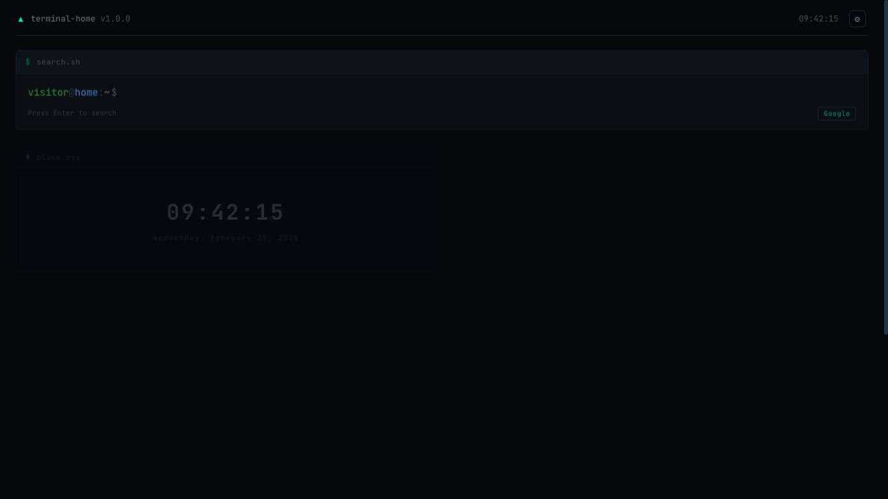

# Home — CLI-Style Chrome New Tab

> A terminal-aesthetic Chrome new tab extension. Dark / Light theme, minimal, functional.
>
> 一个终端美学风格的 Chrome 新标签页扩展。深色 / 浅色主题，极简，实用。


> 🤖 This project is 100% developed by AI.
>
> 🤖 本项目 100% 由 AI 开发。



---

## Features | 功能

### `search.sh` — Search Bar | 搜索栏
- Terminal prompt style: `visitor@home:~$`
- Switch between Google / Bing / DuckDuckGo / Baidu by clicking the badge
- Press `/` to focus search input anywhere
- 终端提示符风格，支持四大搜索引擎一键切换

### `clock.sys` — Clock | 时钟
- Large digital clock with live seconds
- English or Chinese date format (configurable in settings)
- Chinese mode includes **lunar calendar** with Heavenly Stems & Earthly Branches (天干地支) and Chinese zodiac (生肖)
- 支持中文日期格式 + 农历显示（干支纪年、生肖）

### `netstat` — IP Info | 网络信息
- **EXIT NODE**: Proxy/VPN exit IP with ISP, geolocation, timezone
- **DOMESTIC EXIT (国内出口)**: Your real domestic IP (bypasses VPN split-tunneling via IPIP.net / PCOnline / IP.SB)
- One-click copy button (`cp`) next to each IP address
- Multi-API fallback: ip.sb → ip-api.com → freeipapi → ipify
- 30-minute cache to avoid rate limiting
- 代理出口 IP + 国内直连 IP 双重检测，IP 一键复制

### `market.dat` — Market Prices | 行情数据
- Live crypto & commodity prices from CoinGecko API
- 24h change with color-coded arrows (▲ green / ▼ red)
- Search and add any asset from CoinGecko by name/symbol
- Remove tickers with one click
- 5-minute cache
- 加密货币 & 商品实时价格，支持搜索添加任意资产

### `links.conf` — Shortcuts | 快捷链接
- Categorized link groups (e.g., WORK / DEV / MEDIA)
- Inline add/edit/delete — no separate settings page needed
- 分类快捷链接，支持行内编辑

### Drag & Drop | 拖拽排序
- Rearrange the 4 panels (clock, netstat, market, shortcuts) by dragging
- Order persists across sessions via localStorage
- 四个面板自由拖拽排序，布局自动保存

### Theme Toggle | 主题切换
- Switch between **Dark** and **Light** theme with one click (☀ / ☾ button in top bar)
- Theme preference persists across sessions
- 支持深色 / 浅色主题一键切换，偏好自动保存

### Settings | 设置
- Username, search engine, clock format
- Shortcut categories & links editor
- Market watchlist editor with CoinGecko search
- All changes apply immediately on save
- 用户名、搜索引擎、时钟格式、快捷链接、行情列表 — 全部可配

---

## Keyboard Shortcuts | 快捷键

| Key | Action |
|-----|--------|
| `/` | Focus search input · 聚焦搜索 |
| `Enter` | Search · 搜索 |
| `Ctrl + ,` | Open settings · 打开设置 |
| `Esc` | Close settings · 关闭设置 |

---

## Design | 设计

- **Theme**: Deep dark terminal (#0a0e14) + clean light mode (#f7f8fa), switchable via top-bar toggle
- **Font**: JetBrains Mono
- **Layout**: 2×2 responsive grid (single column on mobile)
- **Effects**: Staggered fade-in animations, subtle CRT scanline overlay
- **Persistence**: All config stored in `localStorage` with `th_` prefix

---

## Project Structure | 项目结构

```
chrome-homepage/
├── manifest.json          # Chrome MV3 manifest
├── newtab.html            # Main page
├── css/
│   └── style.css          # Terminal dark theme styles
├── js/
│   └── app.js             # All application logic (single IIFE)
├── icons/
│   ├── icon16.png
│   ├── icon48.png
│   └── icon128.png
├── docs/
│   └── screenshot.png     # Preview screenshot
└── README.md
```

**Zero dependencies.** Pure HTML + CSS + JavaScript. No build tools, no frameworks.

---

## Install Manually (Developer Mode) | 手动安装（开发者模式）

1. Clone this repo · 克隆仓库
   ```bash
   git clone https://github.com/MattMin/chrome-homepage.git
   ```
2. Open `chrome://extensions` in Chrome
3. Enable **Developer mode** · 开启开发者模式
4. Click **Load unpacked** · 点击「加载已解压的扩展程序」
5. Select the `chrome-homepage` folder · 选择项目文件夹
6. Open a new tab ✨ · 打开新标签页

---

## API Sources | 数据来源

| Data | APIs |
|------|------|
| Proxy IP | api.ip.sb → ip-api.com → freeipapi.com → ipify.org |
| Domestic IP | myip.ipip.net → whois.pconline.com.cn → api.ip.sb |
| Market | CoinGecko (free, no key required) |

All APIs are free and require no authentication.

---

## License

MIT
